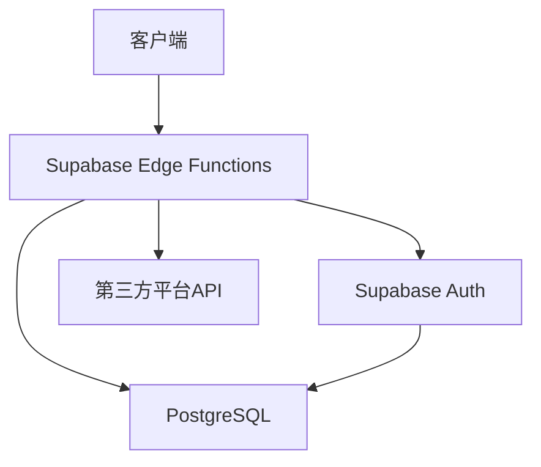

### 基于Supabase的多渠道登录方案设计

本文提供一套完整的 **微信H5/抖音/小程序/手机号/邮箱登录方案**，结合Supabase Auth特性，解决多平台账号绑定、用户身份合并、数据一致性等问题。

---

### 一、方案概述

#### 1. 技术选型
- **Supabase Auth**: 提供基础的身份认证框架
- **PostgreSQL**: 数据存储与关系管理
- **JWT**: 用户会话管理
- **WebAuthn**: （可选）生物认证支持

#### 2. 功能特性
- 多渠道统一登录（微信生态、抖音、手机号、邮箱等）
- 账号打通与身份合并
- 数据安全与隐私保护
- 多端同步
- 防重复注册与账号复用

#### 3. 系统架构


### 一、数据库设计

#### 1. 核心表结构

```sql
-- 用户主表（Supabase自带 auth.users）
-- 包含默认字段：id(uuid), email, phone, created_at, updated_at等
-- 需添加自定义字段：
ALTER TABLE auth.users ADD COLUMN nickname VARCHAR(255);
ALTER TABLE auth.users ADD COLUMN avatar_url TEXT;

-- 第三方授权关联表
CREATE TABLE user_identities (
  id UUID PRIMARY KEY DEFAULT uuid_generate_v4(),
  user_id UUID NOT NULL REFERENCES auth.users(id) ON DELETE CASCADE,
  provider TEXT NOT NULL,  -- 如 wechat, douyin, wechat_mini等
  provider_uid TEXT NOT NULL, -- 各平台唯一ID（如微信openid）
  extra_data JSONB, -- 存储unionid、session_key等敏感或平台特定数据
  UNIQUE(provider, provider_uid) -- 防止重复绑定
);
```

#### 2. 字段说明
- **auth.users**：存储用户核心信息，手机号/邮箱需设置唯一约束
- **user_identities**：记录用户与第三方登录方式的关联关系

### 二、多渠道登录实现逻辑

#### 1. 微信H5登录流程

前端调用方式：
```javascript
const code = await getWechatCode();
const { data, error } = await supabase.functions.invoke('handle-wechat-login', {
  body: { 
    code,
    app_id: 'YOUR_WECHAT_APPID'
  }
});

// 处理返回的token
if (error) throw error;

// 1. 设置用户会话
await supabase.auth.setSession({
  access_token: data.jwt,
  refresh_token: data.refresh_token
});

// 2. 更新本地用户信息
await supabase.auth.updateUser({
  data: {
    nickname: data.nickname,
    avatar: data.avatar_url
  }
});

// 3. 存储token到本地（可选）
localStorage.setItem('wechat_auth', JSON.stringify({
  access_token: data.jwt,
  expires_at: Date.now() + data.expires_in * 1000
}));

return data;
```

Edge Function代码：
```typescript
import { serve } from "https://deno.land/std@0.192.0/http/server.ts";
import { createClient } from "https://esm.sh/@supabase/supabase-js@2.39.0";

interface WechatResponse {
  openid: string;
  session_key?: string;
  unionid?: string;
  phone?: string;
}

const supabaseAdmin = createClient(
  Deno.env.get("SUPABASE_URL")!,
  Deno.env.get("SUPABASE_SERVICE_ROLE_KEY")!
);

serve(async (req) => {
  try {
    const { code, app_id } = await req.json();
    
    // 1. 调用微信API获取用户信息
    const wechatRes = await fetch(`https://api.weixin.qq.com/sns/oauth2/access_token?appid=${app_id}&secret=${Deno.env.get("WECHAT_SECRET")}&code=${code}&grant_type=authorization_code`);
    const wechatData: WechatResponse = await wechatRes.json();
    
    // 2. 查询现有用户
    const { data: identity } = await supabaseAdmin
      .from('user_identities')
      .select('user_id')
      .eq('provider', 'wechat')
      .eq('provider_uid', wechatData.openid)
      .single();

    let userId = identity?.user_id;
    
    // 3. 新用户注册流程
    if (!userId) {
      // 创建Auth用户
      const { data: user, error } = await supabaseAdmin.auth.admin.createUser({
        phone: wechatData.phone,
        user_metadata: {
          nickname: wechatData.openid,
          provider: 'wechat'
        }
      });
      
      if (error) throw error;
      userId = user.id;

      // 创建身份关联
      await supabaseAdmin.from('user_identities').insert({
        user_id: userId,
        provider: 'wechat',
        provider_uid: wechatData.openid,
        extra_data: wechatData
      });
    }

    // 4. 生成访问令牌
    const { data: { session } } = await supabaseAdmin.auth.admin.createSession(userId, {
      // 自定义声明（可选）
      claims: {
        wechat_openid: wechatData.openid
      }
    });

    return new Response(JSON.stringify({
      user_id: userId,
      access_token: session?.access_token,
      refresh_token: session?.refresh_token
    }), { status: 200 });

  } catch (error) {
    return new Response(JSON.stringify({ error: error.message }), { 
      status: 500,
      headers: { 'Content-Type': 'application/json' } 
    });
  }
});
```

#### 2. 抖音登录
类似微信流程，需注意：
- 使用抖音OAuth接口获取`open_id`
- 存储`extra_data`中的`anonymous_id`用于无感绑定

```typescript
// uniapp抖音登录实现
export const douyinLogin = async () => {
  try {
    // 1. 获取抖音授权码
    const [err, loginRes] = await uni.login({
      provider: 'douyin',
      force: false
    });
    
    if (err) {
      throw new Error('抖音登录失败');
    }
    
    // 2. 获取用户信息
    const [userErr, userInfo] = await uni.getUserInfo({
      provider: 'douyin'
    });
    
    if (userErr) {
      throw new Error('获取用户信息失败');
    }
    
    // 3. 调用后端进行登录认证
    const { data, error } = await supabase.rpc('handle_douyin_login', {
      code: loginRes.code,
      user_info: userInfo,
      anonymous_openid: uni.getStorageSync('douyin_anonymous_openid') || ''
    });
    
    if (error) throw error;
    
    // 4. 保存登录状态
    await supabase.auth.setSession({
      access_token: data.jwt,
      refresh_token: data.refresh_token
    });
    
    // 5. 存储匿名openid用于后续无感登录
    if (data.anonymous_openid) {
      uni.setStorageSync('douyin_anonymous_openid', data.anonymous_openid);
    }
    
    return data;
  } catch (error) {
    console.error('抖音登录错误:', error);
    throw error;
  }
};
```

#### 3. 小程序登录
特殊处理项：
- 需解密手机号（使用`session_key` + `encryptedData`）
- 在`extra_data`中存储`unionid`（跨平台用户识别）

```typescript
// uniapp小程序登录实现
export const miniProgramLogin = async () => {
  try {
    // 1. 获取小程序code
    const [err, loginRes] = await uni.login({
      provider: 'weixin'
    });
    
    if (err) {
      throw new Error('小程序登录失败');
    }
    
    // 2. 获取加密的用户信息
    const [userErr, userInfo] = await uni.getUserInfo({
      provider: 'weixin',
      lang: 'zh_CN'
    });
    
    if (userErr) {
      throw new Error('获取用户信息失败');
    }
    
    // 3. 调用后端登录接口
    const { data: loginData, error: loginError } = await supabase.rpc('handle_mini_program_login', {
      code: loginRes.code,
      encrypted_data: userInfo.encryptedData,
      iv: userInfo.iv
    });
    
    if (loginError) throw loginError;
    
    // 4. 获取手机号（如果需要）
    const getPhoneNumber = async (e: any) => {
      if (e.detail.errMsg !== 'getPhoneNumber:ok') {
        throw new Error('用户拒绝授权手机号');
      }
      
      const { data: phoneData, error: phoneError } = await supabase.rpc('bind_mini_program_phone', {
        encrypted_data: e.detail.encryptedData,
        iv: e.detail.iv,
        user_id: loginData.user_id
      });
      
      if (phoneError) throw phoneError;
      
      return phoneData;
    };
    
    // 5. 设置登录态
    await supabase.auth.setSession({
      access_token: loginData.jwt,
      refresh_token: loginData.refresh_token
    });
    
    return {
      ...loginData,
      getPhoneNumber // 返回手机号获取方法供后续使用
    };
  } catch (error) {
    console.error('小程序登录错误:', error);
    throw error;
  }
};

// 小程序手机号授权按钮组件示例
<button 
  open-type="getPhoneNumber" 
  @getphonenumber="async e => {
    try {
      const result = await loginResult.getPhoneNumber(e);
      // 处理手机号绑定成功
    } catch (error) {
      // 处理错误
    }
  }"
>
  授权手机号
</button>
```

#### 4. 手机号/邮箱登录
直接使用Supabase内置方法：
```javascript
// 手机号登录
const { data, error } = await supabase.auth.signInWithOtp({
  phone: '+8613800138000'
});

// 邮箱密码登录
await supabase.auth.signInWithPassword({
  email: 'user@example.com',
  password: '*****'
});
```

### 三、多账号合并策略

#### 1. 自动合并条件
当检测到 **同一设备** 或 **相同手机号/邮箱** 时触发自动合并：
```sql
-- 在创建新授权时检查
IF EXISTS (
  SELECT 1 FROM auth.users 
  WHERE phone = new_phone 
  AND id != current_user_id
) THEN
  RAISE EXCEPTION 'PHONE_ALREADY_EXISTS';
END IF;
```

#### 2. 手动合并流程
1. 用户通过A方式登录后，引导绑定B账号
2. 后端验证B账号凭证有效性
3. 执行原子操作：
   ```sql
   BEGIN;
   UPDATE user_identities SET user_id = :main_user_id 
    WHERE user_id = :secondary_user_id;
   DELETE FROM auth.users WHERE id = :secondary_user_id;
   COMMIT;
   ```

#### 3. 会话管理
- 合并后使所有关联设备的JWT失效
- 生成新的JWT并返回前端

### 四、边界情况处理

#### 1. 多平台手机号冲突
- **场景**：用户通过微信绑定手机号A，另一用户直接使用手机号A注册
- **处理**：
  1. 标记冲突账号为`unverified`
  2. 要求用户通过短信验证码确认所有权
  3. 合并数据后删除冗余账号

#### 2. 第三方账号未绑定手机/邮箱
- 强制用户在首次登录时补充信息
- 提供"稍后绑定"选项，但限制部分功能使用

#### 3. 海外手机号处理
- 在`auth.users.phone`字段中统一存储E.164格式（如+85212345678）
- 使用Supabase内置的Phone Auth适配不同国家代码

#### 4. 用户注销
- 软删除`auth.users`记录
- 保留`user_identities`用于防止重复注册

### 五、安全增强措施

1. **敏感操作验证**：
   - 绑定/换绑手机号需短信验证
   - 主邮箱修改需邮件确认

2. **数据加密**：
   ```sql
   -- 对extra_data中的session_key加密存储
   CREATE EXTENSION IF NOT EXISTS pgcrypto;
   UPDATE user_identities SET extra_data = 
    pgp_sym_encrypt(extra_data::text, 'encryption_key');
   ```

3. **日志审计**：
   ```sql
   CREATE TABLE auth_audit_log (
     id SERIAL PRIMARY KEY,
     user_id UUID REFERENCES auth.users(id),
     action TEXT NOT NULL, -- 如 login/bind/merge
     provider TEXT,
     timestamp TIMESTAMPTZ DEFAULT NOW()
   );
   ```

### 六、最佳实践建议

1. **客户端统一处理逻辑**：
   ```javascript
   // 封装统一登录方法
   async function universalLogin(provider, credentials) {
     if (provider === 'wechat') {
       return handleWechatLogin(credentials.code);
     } else if (provider === 'phone') {
       return supabase.auth.signInWithOtp(credentials);
     }
     // ...
   }
   ```

2. **定期清理孤立账号**：
   ```sql
   -- 删除30天未绑定手机/邮箱的账号
   DELETE FROM auth.users 
   WHERE id IN (
     SELECT u.id FROM auth.users u
     LEFT JOIN user_identities i ON u.id = i.user_id
     WHERE u.phone IS NULL AND u.email IS NULL
     AND COUNT(i.id) = 0
     AND u.created_at < NOW() - INTERVAL '30 days'
   );
   ```

3. **多端同步策略**：
   - 使用Supabase Realtime监听用户表变更
   - 当`avatar_url`或`nickname`更新时，推送至所有设备

### 七、性能优化

#### 1. 数据库索引优化
```sql
-- 为常用查询添加索引
CREATE INDEX idx_user_identities_provider ON user_identities(provider);
CREATE INDEX idx_user_identities_provider_uid ON user_identities(provider_uid);
CREATE INDEX idx_users_phone ON auth.users(phone) WHERE phone IS NOT NULL;
```

#### 2. 缓存策略
```javascript
// Redis缓存示例
const cacheKey = `user:${userId}:profile`;
const cachedProfile = await redis.get(cacheKey);
if (cachedProfile) {
  return JSON.parse(cachedProfile);
}

const profile = await fetchUserProfile(userId);
await redis.setex(cacheKey, 3600, JSON.stringify(profile));
```

#### 3. 批量操作优化
```sql
-- 使用批量插入而非单条操作
INSERT INTO user_identities (user_id, provider, provider_uid)
SELECT * FROM unnest($1::uuid[], $2::text[], $3::text[]);
```

### 八、监控与运维

#### 1. 健康检查
```sql
-- 创建健康检查视图
CREATE VIEW auth_health_check AS
SELECT 
  COUNT(*) as total_users,
  COUNT(DISTINCT phone) as unique_phones,
  COUNT(DISTINCT email) as unique_emails,
  COUNT(*) FILTER (WHERE created_at > NOW() - INTERVAL '24 hours') as new_users_24h
FROM auth.users;
```

#### 2. 告警机制
```sql
-- 创建异常登录告警触发器
CREATE OR REPLACE FUNCTION notify_suspicious_login()
RETURNS TRIGGER AS $$
BEGIN
  IF NEW.login_attempts > 5 THEN
    PERFORM pg_notify(
      'auth_alerts',
      json_build_object(
        'type', 'suspicious_login',
        'user_id', NEW.id,
        'attempts', NEW.login_attempts
      )::text
    );
  END IF;
  RETURN NEW;
END;
$$ LANGUAGE plpgsql;
```

#### 3. 数据备份策略
- 定时全量备份
- 实时增量同步
- 多区域容灾

### 九、开发与部署流程

#### 1. 环境配置
```bash
# .env 配置示例
SUPABASE_URL=your-project-url
SUPABASE_ANON_KEY=your-anon-key
WECHAT_APP_ID=your-app-id
DOUYIN_APP_ID=your-app-id
```

#### 2. CI/CD配置
```yaml
# GitHub Actions 示例
name: Deploy Auth Service
on:
  push:
    branches: [main]
jobs:
  deploy:
    runs-on: ubuntu-latest
    steps:
      - uses: actions/checkout@v2
      - name: Deploy to Supabase
        run: supabase db push
```

#### 3. 测试策略
```typescript
// 单元测试示例
describe('Auth Flow', () => {
  it('should handle wechat login', async () => {
    const mockCode = 'test_code';
    const result = await handleWechatLogin(mockCode);
    expect(result).toHaveProperty('user_id');
    expect(result).toHaveProperty('jwt');
  });
});
```

### 十、常见问题与解决方案

#### 1. 跨域问题
```javascript
// Supabase配置跨域
const supabaseClient = createClient(SUPABASE_URL, SUPABASE_ANON_KEY, {
  headers: {
    'Access-Control-Allow-Origin': '*'
  }
});
```

#### 2. 并发控制
```sql
-- 使用行级锁防止并发操作
BEGIN;
SELECT * FROM user_identities 
WHERE user_id = :user_id 
FOR UPDATE;
-- 执行更新操作
COMMIT;
```

#### 3. 数据迁移方案
```sql
-- 创建迁移脚本
CREATE OR REPLACE FUNCTION migrate_legacy_users()
RETURNS void AS $$
BEGIN
  INSERT INTO auth.users (id, email, phone)
  SELECT id, email, phone
  FROM legacy_users
  ON CONFLICT (id) DO UPDATE
  SET email = EXCLUDED.email,
      phone = EXCLUDED.phone;
END;
$$ LANGUAGE plpgsql;
```

---

该方案通过灵活的账号关联机制，在保持Supabase原生Auth能力的同时，适配国内主流登录方式，兼顾安全性与用户体验。通过合理的架构设计和优化措施，确保系统的可扩展性、可维护性和性能表现。